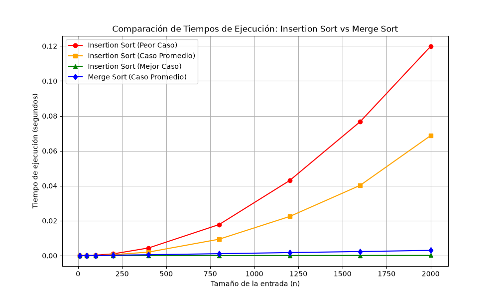

# analisis-de-algoritmos-Labor1-Diego-Quintero

# Laboratorio 1: Fundamentos de Complejidad y Recurrencias

**Curso:** Análisis de Algoritmos  
**Institución:** Instituto Tecnológico Metropolitano (ITM)  
**Grupo:**  (Síncrono)  
**Integrantes:**
- Diego Alejandro Quintero Cano (`diegoquintero212908@correo.itm.edu.co`)

---
## 1. Análisis de Contexto (Sector Salud)

### 1.1. Análisis del Algoritmo vs. Compra de Servidor
Comprar un servidor con el doble de velocidad de procesamiento aumenta la capacidad de cálculo solo en un factor de 2x. Sin embargo, como el algoritmo que está en producción es de complejidad cuadrática O(n^2) (como ocurre en el peor caso de Insertion Sort), si se duplica la cantidad de datos (2n), el tiempo total de ejecución se multiplica por cuatro:

(2n)^2 = 4n^2

Por esta razón, la mejora de hardware no soluciona el problema de fondo, ya que el crecimiento de las operaciones supera la velocidad del nuevo servidor. La mejor alternativa es optimizar el algoritmo cambiando a una complejidad de O(n log n) como la de Merge Sort, lo que reduce drásticamente las operaciones sin gastar en infraestructura.

### 1.2. Responsabilidad Ética y Ambiental
- Responsabilidad Ambiental: Los servidores consumen mucha energía eléctrica. Si ejecutamos algoritmos ineficientes por horas, generamos un gasto energético innecesario y mayor huella de carbono.
- Responsabilidad Ética: En el área de la salud, procesar a tiempo los datos de los pacientes es vital para entregar diagnósticos y tratamientos oportunos. Retrasos en el sistema pueden impactar la atención médica.

---

## 2. Demostración Teórica de la Recurrencia de Merge Sort

La ecuación de recurrencia de Merge Sort se expresa como:
T(n) = 2T(n/2) + c*n

Donde:
- 2T(n/2): Son las dos llamadas recursivas sobre las mitades del arreglo.
- c*n: Es el tiempo que toma combinar (merge) las sublistas ordenadas.

### Demostración mediante el Método Maestro
El Método Maestro analiza recurrencias de la forma T(n) = aT(n/b) + f(n).

1. Identificación de parámetros:
   - a = 2 (número de subproblemas)
   - b = 2 (factor de división)
   - f(n) = c*n = Theta(n)

2. Comparación de términos:
   - Calculamos n^(log_b a) = n^(log_2 2) = n^1 = n.
   - Como f(n) = c*n crece a la misma velocidad que n, aplicamos el Caso 2 del Método Maestro.

3. Resultado:
   T(n) = Theta(n^(log_b a) * log n) = Theta(n log n)

Por lo tanto, queda demostrado que la complejidad asintótica de Merge Sort es O(n log n).

---

## 3. Comparación Experimental y Resultados

### Gráfica Obtenida

### Análisis de Resultados
- Insertion Sort:
  - Peor Caso O(n^2): Se observa una curva parabólica que crece muy rápido al aumentar los datos.
  - Caso Promedio O(n^2): Presenta un comportamiento cuadrático elevado similar al peor caso.
  - Mejor Caso O(n): Muestra un crecimiento lineal cuando la lista ya viene ordenada.
- Merge Sort:
  - Caso Promedio O(n log n): Muestra una línea casi plana en comparación con Insertion Sort, lo que prueba su eficiencia y escalabilidad.

---

## 4. Recomendaciones Técnicas para la Secretaría de Salud

1. Reemplazo del Algoritmo: Cambiar la implementación actual de Insertion Sort por Merge Sort u otro algoritmo eficiente O(n log n).
2. Optimización de Recursos: Cancelar la compra del servidor con doble velocidad, ya que mejorando el código el proceso terminará holgadamente dentro de las 4 horas requeridas.
3. Mantenimiento del Código: Mantener el proyecto versionado en Git y documentado para facilitar futuras mejoras.